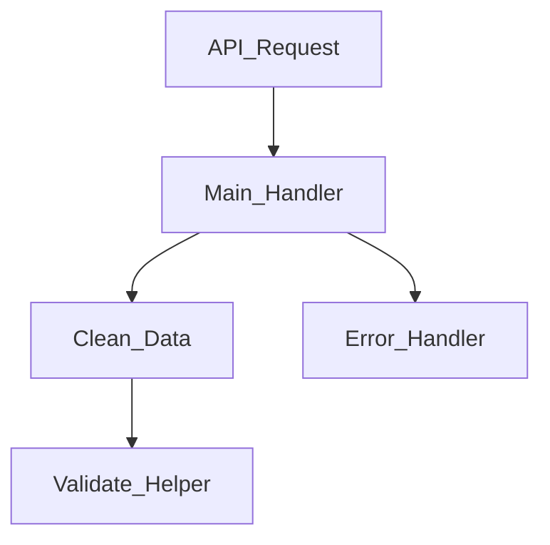
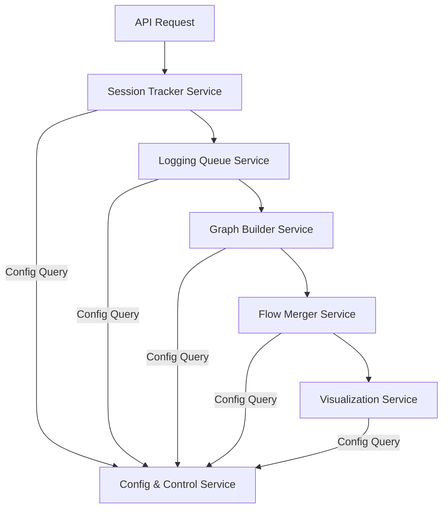

<!-- @format -->
# Full details high-level
- **Session-based flow tracking**
- **Function input/output shape logging**
- **Nested call capturing**
- **Graph-based internal structure**
- **Branching logic & result types**
- **Flow merging into full architecture**
- **Export & visualization tools**
- **Production toggle** to disable tracking in production if needed
- **Timing decorator integration** to measure function execution speed
- **Async/Batched Logging** using a dedicated queue class and background processing
- **Individual logging per flow**, even if millions of requests occur, without coupling requests from the same user

---

# 📜 Final FlowLogger System Plan

---

## 1. 🎯 **Goal**

Design and build a **FlowLogger** system to:

- **Dynamically track the flow of data** in a Python API or system.
- Log **input/output structure** (capturing field names/types, not full data) for each function call.
- **Capture nested function calls** and call chain relationships.
- Record and differentiate **branching behaviors** (e.g., errors, partial, success) for each session.
- Provide **beautiful, exportable visualizations** (Graphviz, Mermaid, JSON, or interactive D3.js) of these flows.
- Enable **detailed analysis** (e.g., stats on frequent paths, anomalies, error trends).
- **Merge all individual flows** into a unified architectural map that reflects the system's true, static behavior despite each request's uniqueness.

> 💡 **Key Principle:**  
> Although each flow is unique per request (or API call), the underlying system architecture remains static. Logging each session individually allows for merging flows into a true representation of the system’s full behavior.

---

## 2. ⚙️ **System Components**

### 2.1. `FlowLogger` Class (Core Manager)

The central manager, responsible for:

- **Managing logging sessions** on a per-request basis.
- **Storing function call metadata** (input/output shapes, result types, timestamps).
- **Building the internal graph** representing calls and relationships.
- **Exporting the graph** for visualization and analysis.
- **Merging** multiple session graphs into one master architectural diagram.

---

### 2.2. `@track_flow` Decorator

This decorator is applied to API endpoints, core functions, and critical helpers.

**Responsibilities:**

- **Before execution:**
  - Log the function’s **name**, the **caller**, and the **input structure**.
- **After execution:**
  - Log the **output structure**.
  - Record the **result type** (success, error, or partial).
  - Log **execution timing** (start and end timestamps).
- **On exception:**
  - Capture and mark the error in the flow.
- **Nested call handling:**
  - Automatically track parent-child relationships of functions.

**Performance Considerations:**

- **Production Toggle:**
  - Implement a configurable setting (via an environment variable or configuration file) that can disable the tracking in production environments, turning the decorator into a no-operation (no-op) where necessary.
  - Example:
    ```python
    import os
    if os.getenv("TRACK_FLOW_ENABLED", "true") == "true":
        # use the full decorator
    else:
        def track_flow(func):
            return func  # No-op if tracking is disabled
    ```
- **Timing Decorator:**
  - Integrate a timing decorator (either within `@track_flow` or as a separate composite decorator) to record how long each function or subfunction takes to execute.

---

### 2.3. Per-Function Call Data Logged

Each function call will log the following details:

| Field             | Description                                                 |
| ----------------- | ----------------------------------------------------------- |
| `function_name`   | Name of the function being tracked                          |
| `caller`          | Name of the function that called this function              |
| `input_shape`     | The structure (field names/types) of the input parameters   |
| `output_shape`    | The structure of the returned data                          |
| `result_type`     | Indicates `"success"`, `"error"`, or `"partial"` result     |
| `timestamp_start` | When the function started (for timing/performance analysis) |
| `timestamp_end`   | When the function ended (for timing/performance analysis)   |

---

### 2.4. Internal Graph Representation

The FlowLogger uses a directed graph structure (e.g., with `networkx.DiGraph` or custom in-memory dicts):

- **Nodes:** Represent functions, annotated with input/output structures.
- **Edges:** Capture caller → callee relationships, with metadata about branch types (success, error, etc.).
- **Graph Merging:**
  - Later, multiple sessions can be merged into one master graph that represents the full architectural behavior.

---

## 3. 🖼️ Visualization & Export

Export options for the internal graph include:

| Format               | Purpose                                         |
| -------------------- | ----------------------------------------------- |
| **Graphviz `.dot`**  | Generate clean, static visual maps              |
| **Mermaid.js**       | Embed interactive diagrams in Markdown/docs     |
| **JSON**             | Feed into analytics tools or custom visualizers |
| **(Optional) D3.js** | Interactive, web-based exploration of flows     |

### Mermaid Example Visualization:



---

## 4. 💎 Advanced Features

### 4.1. Session-Based Logging

- **Per-request Tracking:**
  - Each API request or flow session is logged individually.
- **Multi-user Support:**
  - Even with millions of requests per second, each session remains isolated.
  - No coupling occurs between flows from the same user vs. different users; every session is logged independently.

---

### 4.2. Flow Merging (🔥 Core Feature)

- **merge_flows() Function:**

  - Combines all logged sessions into a single master graph.
  - Unifies repeated functions and consolidates different branching paths.
  - Optionally tracks the frequency of each path or variant of function outputs.

- **Outcome:**
  - The master graph forms a blueprint of the **entire system’s behavior** as observed across all sessions.

---

### 4.3. Behavioral Stats & Diffing (Future Enhancements)

- **Statistics Collection:**
  - Frequency of specific paths
  - Occurrence of error branches over time
- **Field Differences:**
  - Detect variations in output structure for the same function across sessions

---

### 4.4. Visualization Controls (Future UX Enhancements)

- **Filtering Options:**
  - Show only error paths, frequently used functions, or specific modules.
- **Graph Interactivity:**
  - Collapse/expand nested flows, group by module.

---

### 4.5. Async/Batched Logging

- **Queue-Based Logging:**
  - Implement a dedicated **queue class** for batched logging.
  - The logger places log events into the queue.
  - A background thread (or async worker) processes the queue to write logs or update the graph without blocking the main thread.
- **Scalability:**
  - Ensures that even under heavy multi-user traffic (millions of requests), the logging overhead is minimal.
  - Each request is logged individually while still being processed asynchronously.

---

## 5. 🧱 Implementation Plan

| Step | Task                                 | Description                                                                                     |
| ---- | ------------------------------------ | ----------------------------------------------------------------------------------------------- |
| 1    | Build `FlowLogger` class             | Core manager for session data, graph building, and merging                                      |
| 2    | Create `@track_flow` decorator       | Hooks into target functions for logging inputs/outputs, parent-child relationships, and timings |
| 3    | Implement input/output shape capture | Record function signatures (shape, not full data)                                               |
| 4    | Add exception logging                | Capture error states as special branches in the flow                                            |
| 5    | Implement nested call stack tracking | Maintain context for parent → child relationships                                               |
| 6    | Model internal graph structure       | Using `networkx` or custom in-memory data structures                                            |
| 7    | Develop exporter modules             | Export to Graphviz `.dot`, Mermaid, JSON, etc.                                                  |
| 8    | Build `merge_flows()` function       | Merge all session flows into one master architectural view                                      |
| 9    | Integrate a timing decorator         | Record execution time for each decorated function                                               |
| 10   | Develop async/batched logging        | Build a queue class with a background thread for log processing                                 |
| 11   | Sample flow simulation and testing   | Run tests on a demo API or simulated flows                                                      |
| 12   | (Optional) Build a Web UI            | An interactive D3.js-based viewer for exploring flows                                           |

---

## 6. 🧪 Tech Stack & Tools

| Area                | Tool/Technology                                        |
| ------------------- | ------------------------------------------------------ |
| **Language**        | Python 3.9+                                            |
| **Decorator**       | Custom `@track_flow` with integrated timing            |
| **Graph Structure** | `networkx` or custom in-memory dicts                   |
| **Visualization**   | Graphviz, Mermaid.js, optionally D3.js                 |
| **Storage**         | In-memory, with JSON export capability                 |
| **Logging**         | Async queue processing, configurable production toggle |
| **Testing**         | Pytest, profiling (e.g., cProfile)                     |

---

## 7. 📂 Suggested File/Module Layout

```
flowlogger/
│
├── __init__.py
├── core.py              # FlowLogger class
├── decorators.py        # @track_flow + timing decorator
├── graph.py             # Graph builder and merger (merge_flows function)
├── exporter.py          # Export to Mermaid, Graphviz, JSON, etc.
├── queue.py             # Asynchronous queue for batched logging
├── types.py             # Data types and enums (result_type, etc.)
├── config.py            # Production toggle settings and other configurations
├── utils.py             # Helper functions
└── demo/
    └── sample_api.py    # Demo API for testing the FlowLogger system
```

---

## ✅ Summary

| Feature                                         | Included |
| ----------------------------------------------- | -------- |
| **Track inputs/outputs**                        | ✅       |
| **Decorator-based capture**                     | ✅       |
| **Nested call / Call tree tracking**            | ✅       |
| **Exception handling**                          | ✅       |
| **Execution timing logging**                    | ✅       |
| **Async/Batched logging via a dedicated queue** | ✅       |
| **Production toggle for performance control**   | ✅       |
| **Graph-based internal representation**         | ✅       |
| **Export to visual tools**                      | ✅       |
| **Per-request flow logging**                    | ✅       |
| **Flow merging into full architecture**         | ✅       |
| **Future: diffing, stats, interactive UI**      | ✅       |

# Divided


# part 2


# FlowLogger System: The Ultimate Final Plan

## 1. Overview

The FlowLogger system is a distributed microservice solution designed to dynamically track data flows in a Python API or system. The system logs the input/output structures (capturing field names and data types, not full data) of each function call, captures nested calls, and records branching outcomes (e.g., errors, partial success). These individual flows can later be merged into a master architecture graph that provides detailed insights into the system’s behavior. The entire system is also designed with production performance in mind, allowing toggling of the tracking functionality.

---

## 2. Microservice Components

The system is decomposed into several autonomous microservices. Each microservice focuses on one aspect of the FlowLogger functionality. The following is an in-depth description of each service and its role:

### 2.1 Session Tracker Service

**Purpose:**  
- Monitors the execution of individual API requests or function calls.
- Logs detailed metadata of each function call using the `@track_flow` decorator.
- Maintains session-specific metadata including unique session IDs, nesting contexts, and timing details.

**Responsibilities:**
- **Decorator Handling:**  
  The custom `@track_flow` decorator wraps target functions to:
  - Capture the function name, caller, input shape (i.e., field names and types),
  - Capture output shape, result type (success, error, or partial),
  - Log start and end timestamps.
- **Session Management:**  
  Assigns a unique identifier (UUID recommended) to each session/request.
- **Data Dispatch:**  
  Once a function call is finished, the log event is sent (locally or over a message bus) to the Logging Queue Service.

**API & Interface Example:**
- **Local Invocation:**  
  In-process function call with asynchronous non-blocking dispatch.
- **Data Schema (Log Event):**  
  ```json
  {
    "session_id": "uuid",
    "function_name": "process_user_data",
    "caller": "main_handler",
    "input_shape": { "user_id": "str", "data": "dict" },
    "output_shape": { "result": "bool", "errors": "list" },
    "result_type": "success",
    "timestamp_start": "2025-04-11T12:34:56.123Z",
    "timestamp_end": "2025-04-11T12:34:56.456Z"
  }
  ```
- **Production Toggle:**  
  Evaluate an environment variable (e.g., `TRACK_FLOW_ENABLED`). If disabled, the decorator becomes a no-op.

**Integration Notes:**  
- Should be integrated into the business logic at the module level.
- Works as an embedded library within the application which then forwards logs to the Logging Queue Service.

---

### 2.2 Logging Queue Service

**Purpose:**  
Acts as an asynchronous buffer, decoupling the log generation (from the Session Tracker) from downstream processing (Graph Builder).

**Responsibilities:**
- **Message Queueing:**  
  Receives structured log events from Session Tracker and temporarily stores them.
- **Batching & Flushing:**  
  Periodically processes logs in batches to avoid performance bottlenecks.
- **Communication Methods:**  
  Could use in-process queues (for lower volumes) or external systems such as Redis, Kafka, or RabbitMQ for higher volumes.
  
**Data Flow & Schema:**
- **Input (Batched Logs):**
  ```json
  {
    "session_id": "uuid",
    "events": [
      { ... individual log events as specified above ... }
    ]
  }
  ```
- **Output:**  
  Forwards these batched logs to the Graph Builder Service via HTTP or through a pub/sub mechanism.
  
**Integration Notes:**
- The service must ensure at-least-once delivery.
- Must include persistence or acknowledgment mechanisms to prevent data loss.
- Needs to be horizontally scalable and fault tolerant.

---

### 2.3 Graph Builder Service

**Purpose:**  
Constructs a directed graph representation for each session's logged events.

**Responsibilities:**
- **Graph Construction:**  
  Builds a session-specific graph using a library such as `networkx` or custom in-memory structures.  
  - **Nodes** represent function calls with metadata (input/output shapes, timings).
  - **Edges** represent the caller → callee relationship including branch type (success, error, etc.).
- **Storage of Graph Data:**  
  Can persist graphs in a serialized format (JSON, Graphviz DOT, or Mermaid).
- **API Service:**  
  Provides endpoints for retrieving individual session graphs for further analysis or troubleshooting.

**Data Format for Graphs:**
```json
{
  "session_id": "uuid",
  "nodes": [
    {
      "id": "validate_input",
      "function_name": "validate_input",
      "input_shape": { ... },
      "output_shape": { ... },
      "result_type": "success",
      "timestamp_start": "2025-04-11T12:34:56.123Z",
      "timestamp_end": "2025-04-11T12:34:56.234Z"
    }
  ],
  "edges": [
    {
      "from": "main_handler",
      "to": "validate_input",
      "branch": "success"
    }
  ]
}
```

**Integration Notes:**
- Receives batched logs from the Logging Queue Service.
- Must support idempotency and handling of repeated sessions.
- Exposes a REST API for visualizing or exporting session graphs.

---

### 2.4 Flow Merger Service

**Purpose:**  
Aggregates individual session graphs into one master system architecture graph.

**Responsibilities:**
- **Graph Merging:**  
  - Consolidate nodes that refer to the same function.
  - Merge edges from multiple sessions while maintaining branch metadata (frequency counts, error trends).
- **Anomaly & Stats Collection:**  
  Optionally calculate statistics (e.g., most frequent paths, error hotspots, deviations in output shapes).
- **Storage & Versioning:**  
  Save the unified master graph and track its evolution over time.

**Data Schema (Merged Graph Format):**
```json
{
  "graph_type": "merged",
  "nodes": [
    { "id": "main_handler", "occurrences": 100000, "input_shape": { ... }, "output_shape": { ... } },
    { "id": "validate_input", "occurrences": 98000, "input_shape": { ... }, "output_shape": { ... } }
  ],
  "edges": [
    { "from": "main_handler", "to": "validate_input", "branch": "success", "frequency": 98000 }
  ],
  "stats": {
    "total_sessions": 100000,
    "frequent_paths": [ { "path": "main_handler → validate_input", "count": 98000 } ],
    "error_nodes": [ "error_handler" ]
  }
}
```

**Integration Notes:**
- The merger can operate on a scheduled basis (e.g., nightly batches) or continuously using streaming.
- Must be designed to scale and potentially use a dedicated processing cluster or database.
- Provides endpoints to query the master graph for system-wide diagnostics and analysis.

---

### 2.5 Visualization Service

**Purpose:**  
Renders graphs for human consumption and provides export options in various formats.

**Responsibilities:**
- **Format Conversions:**  
  Converts graph representations to:
  - Graphviz DOT (static diagrams)
  - Mermaid.js (Markdown embedded interactive diagrams)
  - JSON for D3.js-based interactive views
- **Interactive UI:**  
  Optionally serve a web UI that allows users to explore graphs dynamically.
- **REST Endpoints:**  
  API endpoints to request export in a desired format, applying filtering (e.g., only error paths) if needed.

**API & Export Examples:**
- **Graphviz Export Endpoint:**  
  - URL: `/export/graphviz`
  - Response: A .dot file content for download.
- **Mermaid Export Endpoint:**  
  - URL: `/export/mermaid`
  - Response: Mermaid formatted text.
- **JSON Export Endpoint:**  
  - URL: `/export/json`
  - Response: Raw JSON of the master or session graph.

**Integration Notes:**
- Consumes graph data from the Graph Builder or the Flow Merger service.
- Should be decoupled to allow for independent scaling and UI changes.
- Authentication may be applied to restrict access if sensitive metadata is involved.

---

### 2.6 Config & Control Service

**Purpose:**  
Centralizes configuration management for all microservices including feature toggles, log levels, and performance configurations.

**Responsibilities:**
- **Global Configuration:**  
  Maintain environment settings such as `TRACK_FLOW_ENABLED`, queue parameters, and merging frequencies.
- **API Service:**  
  Exposes endpoints for other services to query their current configuration.
- **Dynamic Updates:**  
  Allows dynamic reconfiguration (e.g., toggle off logging during high load) without requiring service restarts.

**Integration Notes:**
- Can be implemented using a centralized configuration store such as Consul, etcd, or Redis.
- Each microservice will fetch or subscribe to updates.
- Defines standardized configuration keys that all services must reference.

---

### 2.7 Monitoring & Stats Service (Future Enhancement)

**Purpose:**  
Provides analytics, health monitoring, and anomaly detection on the logged flows.

**Responsibilities:**
- **Real-time Monitoring:**  
  Track errors, path frequencies, and performance anomalies.
- **Dashboard Integration:**  
  Integrate with visualization dashboards like Grafana.
- **Alerting:**  
  Optionally trigger alerts when certain thresholds are breached (e.g., sudden spike in error branches).

**Integration Notes:**  
- This service will consume data from the Flow Merger and Logging Queue.
- Designed to run analytics continuously without affecting logging performance.

---

## 3. Protocol and Data Contracts

Defining a strict data contract is essential so that each microservice knows exactly what to expect when communicating with others. All services exchange data in JSON over HTTP REST APIs, message brokers, or internal function calls. Below are standardized data schemas for each communication point:

### 3.1 Log Event Format (Decorator → Logging Queue)
```json
{
  "session_id": "string (UUID)",
  "function_name": "string",
  "caller": "string",
  "input_shape": { "field": "type", "another_field": "type", "...": "..." },
  "output_shape": { "field": "type", "another_field": "type", "...": "..." },
  "result_type": "success|error|partial",
  "timestamp_start": "ISO8601 timestamp",
  "timestamp_end": "ISO8601 timestamp"
}
```

### 3.2 Batched Logs (Logging Queue → Graph Builder)
```json
{
  "session_id": "string (UUID)",
  "events": [
    { ...individual log event... },
    { ... }
  ]
}
```

### 3.3 Session Graph Format (Graph Builder → Flow Merger)
```json
{
  "session_id": "string (UUID)",
  "nodes": [
    {
      "id": "function_unique_id",
      "function_name": "string",
      "input_shape": { ... },
      "output_shape": { ... },
      "result_type": "success|error|partial",
      "timestamp_start": "ISO8601 timestamp",
      "timestamp_end": "ISO8601 timestamp"
    }
  ],
  "edges": [
    {
      "from": "caller_function_id",
      "to": "callee_function_id",
      "branch": "success|error|partial"
    }
  ]
}
```

### 3.4 Merged Graph Format (Flow Merger → Visualization)
```json
{
  "graph_type": "merged",
  "nodes": [
    {
      "id": "function_unique_id",
      "occurrences": "int",
      "function_name": "string",
      "input_shape": { ... },
      "output_shape": { ... }
    }
  ],
  "edges": [
    {
      "from": "function_unique_id",
      "to": "function_unique_id",
      "branch": "success|error|partial",
      "frequency": "int"
    }
  ],
  "stats": {
    "total_sessions": "int",
    "frequent_paths": [ { "path": "A->B->C", "count": "int" } ],
    "error_nodes": [ "function_id1", "function_id2" ]
  }
}
```

---

## 4. Integration & Interaction Architecture

### 4.1 Overall Flow of Data
1. **Function Call Execution:**  
   - A function decorated with `@track_flow` executes.
   - The decorator logs the function call metadata (input, output, timing, error status).
2. **Session Tracker → Logging Queue:**  
   - The log event is immediately sent (or enqueued) to the Logging Queue Service.
3. **Batch Processing:**  
   - The Logging Queue Service batches log events and forwards them periodically or on-demand to the Graph Builder Service.
4. **Graph Building:**  
   - The Graph Builder constructs a directed graph per session based on the received log events.
5. **Graph Merging:**  
   - Periodically (or triggered by events), the Flow Merger Service merges the session graphs into a master architecture graph.
6. **Visualization:**  
   - The Visualization Service allows users to export or view both session-specific and merged graphs in various formats.
7. **Config & Control:**  
   - All microservices pull configuration settings from the Config & Control Service, ensuring uniform behavior across the platform.

### 4.2 Communication Protocols and Mechanisms

| Interaction                      | Protocol/Mechanism               | Details                                                                 |
|----------------------------------|----------------------------------|-------------------------------------------------------------------------|
| **Decorator → Logging Queue**    | In-process asynchronous call or local messaging | Use a background thread or event loop to prevent blocking. |
| **Logging Queue → Graph Builder** | REST API / Message Broker (e.g., Kafka, RabbitMQ)  | Batching events to reduce load; ensure reliable delivery.               |
| **Graph Builder → Flow Merger**   | Periodic REST API call or batch job              | The merger fetches session graphs and merges them into a master view.   |
| **Graph Merger → Visualization**  | REST API / Shared storage (JSON file, DB)        | Visualization Service fetches the master graph for display/export.      |
| **All Services → Config Service**| Centralized configuration service (etcd, Consul, or Redis) | All microservices periodically update their settings from here.         |

### 4.3 Deployment & Scaling Considerations

- **Containerization:**  
  Package each microservice as its own container (e.g., Docker) for isolated deployment and scaling.
  
- **Orchestration:**  
  Use orchestration tools such as Kubernetes to manage service discovery, scaling, load balancing, and fault tolerance.
  
- **Resilience:**  
  Implement retries, dead-letter queues, and fallback procedures for communication failures between services.
  
- **Logging & Tracing:**  
  Integrate distributed tracing (e.g., using Jaeger or Zipkin) so that the journey of a log event through all microservices can be tracked.

---

## 5. Detailed Module/Service Ownership and Interfaces

### 5.1 Session Tracker (Team A)

- **Files/Modules:**  
  - `track_flow.py` (Decorator code)  
  - `session_manager.py` (Session ID generation, context handling)

- **Interface:**  
  - `@track_flow` decorator: Wraps functions to record metadata.
  - Logs formatted as JSON using the schema provided above.
  
- **Key Integration Point:**  
  Dispatches to the Logging Queue Service using an in-process asynchronous call or RESTful endpoint.

### 5.2 Logging Queue (Team B)

- **Files/Modules:**  
  - `log_queue.py` (Queue class implementation)
  - `broker_client.py` (Abstraction for the message broker or REST client)

- **Interface:**  
  - REST endpoint (or message channel) `/enqueue` that accepts batched log events.
  - Acknowledgment and error handling callbacks.
  
- **Key Integration Point:**  
  Receives logs from Session Tracker; forwards data to the Graph Builder Service.

### 5.3 Graph Builder (Team C)

- **Files/Modules:**  
  - `graph_builder.py` (Graph construction logic using networkx or in-memory dictionaries)
  - `graph_api.py` (REST endpoints to return graph data)

- **Interface:**  
  - Endpoint `/graph/session/{session_id}` to retrieve session graphs.
  - Consumes batched logs, builds a graph, and stores them.

### 5.4 Flow Merger (Team D)

- **Files/Modules:**  
  - `flow_merger.py` (Graph merging logic)
  - `stats_processor.py` (Optional stats and anomaly detection)

- **Interface:**  
  - Scheduled or triggered endpoint `/merge` that initiates graph consolidation.
  - Endpoint `/graph/merged` serving the master graph.
  
- **Key Integration Point:**  
  Fetches session graphs from the Graph Builder Service and provides merged data to the Visualization Service.

# FlowLogger System: The Ultimate Final Plan

## 1. Overview

The FlowLogger system is a distributed microservice solution designed to dynamically track data flows in a Python API or system. The system logs the input/output structures (capturing field names and data types, not full data) of each function call, captures nested calls, and records branching outcomes (e.g., errors, partial success). These individual flows can later be merged into a master architecture graph that provides detailed insights into the system’s behavior. The entire system is also designed with production performance in mind, allowing toggling of the tracking functionality.

---

## 2. Microservice Components

The system is decomposed into several autonomous microservices. Each microservice focuses on one aspect of the FlowLogger functionality. The following is an in-depth description of each service and its role:

### 2.1 Session Tracker Service

**Purpose:**  
- Monitors the execution of individual API requests or function calls.
- Logs detailed metadata of each function call using the `@track_flow` decorator.
- Maintains session-specific metadata including unique session IDs, nesting contexts, and timing details.

**Responsibilities:**
- **Decorator Handling:**  
  The custom `@track_flow` decorator wraps target functions to:
  - Capture the function name, caller, input shape (i.e., field names and types),
  - Capture output shape, result type (success, error, or partial),
  - Log start and end timestamps.
- **Session Management:**  
  Assigns a unique identifier (UUID recommended) to each session/request.
- **Data Dispatch:**  
  Once a function call is finished, the log event is sent (locally or over a message bus) to the Logging Queue Service.

**API & Interface Example:**
- **Local Invocation:**  
  In-process function call with asynchronous non-blocking dispatch.
- **Data Schema (Log Event):**  
  ```json
  {
    "session_id": "uuid",
    "function_name": "process_user_data",
    "caller": "main_handler",
    "input_shape": { "user_id": "str", "data": "dict" },
    "output_shape": { "result": "bool", "errors": "list" },
    "result_type": "success",
    "timestamp_start": "2025-04-11T12:34:56.123Z",
    "timestamp_end": "2025-04-11T12:34:56.456Z"
  }
  ```
- **Production Toggle:**  
  Evaluate an environment variable (e.g., `TRACK_FLOW_ENABLED`). If disabled, the decorator becomes a no-op.

**Integration Notes:**  
- Should be integrated into the business logic at the module level.
- Works as an embedded library within the application which then forwards logs to the Logging Queue Service.

---

### 2.2 Logging Queue Service

**Purpose:**  
Acts as an asynchronous buffer, decoupling the log generation (from the Session Tracker) from downstream processing (Graph Builder).

**Responsibilities:**
- **Message Queueing:**  
  Receives structured log events from Session Tracker and temporarily stores them.
- **Batching & Flushing:**  
  Periodically processes logs in batches to avoid performance bottlenecks.
- **Communication Methods:**  
  Could use in-process queues (for lower volumes) or external systems such as Redis, Kafka, or RabbitMQ for higher volumes.
  
**Data Flow & Schema:**
- **Input (Batched Logs):**
  ```json
  {
    "session_id": "uuid",
    "events": [
      { ... individual log events as specified above ... }
    ]
  }
  ```
- **Output:**  
  Forwards these batched logs to the Graph Builder Service via HTTP or through a pub/sub mechanism.
  
**Integration Notes:**
- The service must ensure at-least-once delivery.
- Must include persistence or acknowledgment mechanisms to prevent data loss.
- Needs to be horizontally scalable and fault tolerant.

---

### 2.3 Graph Builder Service

**Purpose:**  
Constructs a directed graph representation for each session's logged events.

**Responsibilities:**
- **Graph Construction:**  
  Builds a session-specific graph using a library such as `networkx` or custom in-memory structures.  
  - **Nodes** represent function calls with metadata (input/output shapes, timings).
  - **Edges** represent the caller → callee relationship including branch type (success, error, etc.).
- **Storage of Graph Data:**  
  Can persist graphs in a serialized format (JSON, Graphviz DOT, or Mermaid).
- **API Service:**  
  Provides endpoints for retrieving individual session graphs for further analysis or troubleshooting.

**Data Format for Graphs:**
```json
{
  "session_id": "uuid",
  "nodes": [
    {
      "id": "validate_input",
      "function_name": "validate_input",
      "input_shape": { ... },
      "output_shape": { ... },
      "result_type": "success",
      "timestamp_start": "2025-04-11T12:34:56.123Z",
      "timestamp_end": "2025-04-11T12:34:56.234Z"
    }
  ],
  "edges": [
    {
      "from": "main_handler",
      "to": "validate_input",
      "branch": "success"
    }
  ]
}
```

**Integration Notes:**
- Receives batched logs from the Logging Queue Service.
- Must support idempotency and handling of repeated sessions.
- Exposes a REST API for visualizing or exporting session graphs.

---

### 2.4 Flow Merger Service

**Purpose:**  
Aggregates individual session graphs into one master system architecture graph.

**Responsibilities:**
- **Graph Merging:**  
  - Consolidate nodes that refer to the same function.
  - Merge edges from multiple sessions while maintaining branch metadata (frequency counts, error trends).
- **Anomaly & Stats Collection:**  
  Optionally calculate statistics (e.g., most frequent paths, error hotspots, deviations in output shapes).
- **Storage & Versioning:**  
  Save the unified master graph and track its evolution over time.

**Data Schema (Merged Graph Format):**
```json
{
  "graph_type": "merged",
  "nodes": [
    { "id": "main_handler", "occurrences": 100000, "input_shape": { ... }, "output_shape": { ... } },
    { "id": "validate_input", "occurrences": 98000, "input_shape": { ... }, "output_shape": { ... } }
  ],
  "edges": [
    { "from": "main_handler", "to": "validate_input", "branch": "success", "frequency": 98000 }
  ],
  "stats": {
    "total_sessions": 100000,
    "frequent_paths": [ { "path": "main_handler → validate_input", "count": 98000 } ],
    "error_nodes": [ "error_handler" ]
  }
}
```

**Integration Notes:**
- The merger can operate on a scheduled basis (e.g., nightly batches) or continuously using streaming.
- Must be designed to scale and potentially use a dedicated processing cluster or database.
- Provides endpoints to query the master graph for system-wide diagnostics and analysis.

---

### 2.5 Visualization Service

**Purpose:**  
Renders graphs for human consumption and provides export options in various formats.

**Responsibilities:**
- **Format Conversions:**  
  Converts graph representations to:
  - Graphviz DOT (static diagrams)
  - Mermaid.js (Markdown embedded interactive diagrams)
  - JSON for D3.js-based interactive views
- **Interactive UI:**  
  Optionally serve a web UI that allows users to explore graphs dynamically.
- **REST Endpoints:**  
  API endpoints to request export in a desired format, applying filtering (e.g., only error paths) if needed.

**API & Export Examples:**
- **Graphviz Export Endpoint:**  
  - URL: `/export/graphviz`
  - Response: A .dot file content for download.
- **Mermaid Export Endpoint:**  
  - URL: `/export/mermaid`
  - Response: Mermaid formatted text.
- **JSON Export Endpoint:**  
  - URL: `/export/json`
  - Response: Raw JSON of the master or session graph.

**Integration Notes:**
- Consumes graph data from the Graph Builder or the Flow Merger service.
- Should be decoupled to allow for independent scaling and UI changes.
- Authentication may be applied to restrict access if sensitive metadata is involved.

---

### 2.6 Config & Control Service

**Purpose:**  
Centralizes configuration management for all microservices including feature toggles, log levels, and performance configurations.

**Responsibilities:**
- **Global Configuration:**  
  Maintain environment settings such as `TRACK_FLOW_ENABLED`, queue parameters, and merging frequencies.
- **API Service:**  
  Exposes endpoints for other services to query their current configuration.
- **Dynamic Updates:**  
  Allows dynamic reconfiguration (e.g., toggle off logging during high load) without requiring service restarts.

**Integration Notes:**
- Can be implemented using a centralized configuration store such as Consul, etcd, or Redis.
- Each microservice will fetch or subscribe to updates.
- Defines standardized configuration keys that all services must reference.

---

### 2.7 Monitoring & Stats Service (Future Enhancement)

**Purpose:**  
Provides analytics, health monitoring, and anomaly detection on the logged flows.

**Responsibilities:**
- **Real-time Monitoring:**  
  Track errors, path frequencies, and performance anomalies.
- **Dashboard Integration:**  
  Integrate with visualization dashboards like Grafana.
- **Alerting:**  
  Optionally trigger alerts when certain thresholds are breached (e.g., sudden spike in error branches).

**Integration Notes:**  
- This service will consume data from the Flow Merger and Logging Queue.
- Designed to run analytics continuously without affecting logging performance.

---

## 3. Protocol and Data Contracts

Defining a strict data contract is essential so that each microservice knows exactly what to expect when communicating with others. All services exchange data in JSON over HTTP REST APIs, message brokers, or internal function calls. Below are standardized data schemas for each communication point:

### 3.1 Log Event Format (Decorator → Logging Queue)
```json
{
  "session_id": "string (UUID)",
  "function_name": "string",
  "caller": "string",
  "input_shape": { "field": "type", "another_field": "type", "...": "..." },
  "output_shape": { "field": "type", "another_field": "type", "...": "..." },
  "result_type": "success|error|partial",
  "timestamp_start": "ISO8601 timestamp",
  "timestamp_end": "ISO8601 timestamp"
}
```

### 3.2 Batched Logs (Logging Queue → Graph Builder)
```json
{
  "session_id": "string (UUID)",
  "events": [
    { ...individual log event... },
    { ... }
  ]
}
```

### 3.3 Session Graph Format (Graph Builder → Flow Merger)
```json
{
  "session_id": "string (UUID)",
  "nodes": [
    {
      "id": "function_unique_id",
      "function_name": "string",
      "input_shape": { ... },
      "output_shape": { ... },
      "result_type": "success|error|partial",
      "timestamp_start": "ISO8601 timestamp",
      "timestamp_end": "ISO8601 timestamp"
    }
  ],
  "edges": [
    {
      "from": "caller_function_id",
      "to": "callee_function_id",
      "branch": "success|error|partial"
    }
  ]
}
```

### 3.4 Merged Graph Format (Flow Merger → Visualization)
```json
{
  "graph_type": "merged",
  "nodes": [
    {
      "id": "function_unique_id",
      "occurrences": "int",
      "function_name": "string",
      "input_shape": { ... },
      "output_shape": { ... }
    }
  ],
  "edges": [
    {
      "from": "function_unique_id",
      "to": "function_unique_id",
      "branch": "success|error|partial",
      "frequency": "int"
    }
  ],
  "stats": {
    "total_sessions": "int",
    "frequent_paths": [ { "path": "A->B->C", "count": "int" } ],
    "error_nodes": [ "function_id1", "function_id2" ]
  }
}
```

---

## 4. Integration & Interaction Architecture

### 4.1 Overall Flow of Data
1. **Function Call Execution:**  
   - A function decorated with `@track_flow` executes.
   - The decorator logs the function call metadata (input, output, timing, error status).
2. **Session Tracker → Logging Queue:**  
   - The log event is immediately sent (or enqueued) to the Logging Queue Service.
3. **Batch Processing:**  
   - The Logging Queue Service batches log events and forwards them periodically or on-demand to the Graph Builder Service.
4. **Graph Building:**  
   - The Graph Builder constructs a directed graph per session based on the received log events.
5. **Graph Merging:**  
   - Periodically (or triggered by events), the Flow Merger Service merges the session graphs into a master architecture graph.
6. **Visualization:**  
   - The Visualization Service allows users to export or view both session-specific and merged graphs in various formats.
7. **Config & Control:**  
   - All microservices pull configuration settings from the Config & Control Service, ensuring uniform behavior across the platform.

### 4.2 Communication Protocols and Mechanisms

| Interaction                      | Protocol/Mechanism               | Details                                                                 |
|----------------------------------|----------------------------------|-------------------------------------------------------------------------|
| **Decorator → Logging Queue**    | In-process asynchronous call or local messaging | Use a background thread or event loop to prevent blocking. |
| **Logging Queue → Graph Builder** | REST API / Message Broker (e.g., Kafka, RabbitMQ)  | Batching events to reduce load; ensure reliable delivery.               |
| **Graph Builder → Flow Merger**   | Periodic REST API call or batch job              | The merger fetches session graphs and merges them into a master view.   |
| **Graph Merger → Visualization**  | REST API / Shared storage (JSON file, DB)        | Visualization Service fetches the master graph for display/export.      |
| **All Services → Config Service**| Centralized configuration service (etcd, Consul, or Redis) | All microservices periodically update their settings from here.         |

### 4.3 Deployment & Scaling Considerations

- **Containerization:**  
  Package each microservice as its own container (e.g., Docker) for isolated deployment and scaling.
  
- **Orchestration:**  
  Use orchestration tools such as Kubernetes to manage service discovery, scaling, load balancing, and fault tolerance.
  
- **Resilience:**  
  Implement retries, dead-letter queues, and fallback procedures for communication failures between services.
  
- **Logging & Tracing:**  
  Integrate distributed tracing (e.g., using Jaeger or Zipkin) so that the journey of a log event through all microservices can be tracked.

---

## 5. Detailed Module/Service Ownership and Interfaces

### 5.1 Session Tracker (Team A)

- **Files/Modules:**  
  - `track_flow.py` (Decorator code)  
  - `session_manager.py` (Session ID generation, context handling)

- **Interface:**  
  - `@track_flow` decorator: Wraps functions to record metadata.
  - Logs formatted as JSON using the schema provided above.
  
- **Key Integration Point:**  
  Dispatches to the Logging Queue Service using an in-process asynchronous call or RESTful endpoint.

### 5.2 Logging Queue (Team B)

- **Files/Modules:**  
  - `log_queue.py` (Queue class implementation)
  - `broker_client.py` (Abstraction for the message broker or REST client)

- **Interface:**  
  - REST endpoint (or message channel) `/enqueue` that accepts batched log events.
  - Acknowledgment and error handling callbacks.
  
- **Key Integration Point:**  
  Receives logs from Session Tracker; forwards data to the Graph Builder Service.

### 5.3 Graph Builder (Team C)

- **Files/Modules:**  
  - `graph_builder.py` (Graph construction logic using networkx or in-memory dictionaries)
  - `graph_api.py` (REST endpoints to return graph data)

- **Interface:**  
  - Endpoint `/graph/session/{session_id}` to retrieve session graphs.
  - Consumes batched logs, builds a graph, and stores them.

### 5.4 Flow Merger (Team D)

- **Files/Modules:**  
  - `flow_merger.py` (Graph merging logic)
  - `stats_processor.py` (Optional stats and anomaly detection)

- **Interface:**  
  - Scheduled or triggered endpoint `/merge` that initiates graph consolidation.
  - Endpoint `/graph/merged` serving the master graph.
  
- **Key Integration Point:**  
  Fetches session graphs from the Graph Builder Service and provides merged data to the Visualization Service.

### 5.5 Visualization (Team E)

- **Files/Modules:**  
  - `visualizer.py` (Logic to convert graphs to Graphviz, Mermaid, JSON)
  - `web_ui.py` (Optional interactive D3.js-based front-end)

- **Interface:**  
  - REST endpoints for export:  
    - `/export/graphviz`  
    - `/export/mermaid`  
    - `/export/json`
    
- **Key Integration Point:**  
  Consumes data from the Flow Merger service; renders visualizations that can be embedded in documentation or browsed interactively.

### 5.6 Config & Control (Team F)

- **Files/Modules:**  
  - `config_service.py` (Central configuration store API)
  - `client.py` (Client libraries for other services to fetch config)

- **Interface:**  
  - REST endpoints to expose configuration details.
  - Watch mechanisms (e.g., using WebSockets or polling) to push configuration changes.
  
- **Key Integration Point:**  
  All services call this service at startup and periodically for dynamic configuration updates.

### 5.7 Monitoring & Stats (Optional/Future, Team G)

- **Files/Modules:**  
  - `monitoring.py` (Real-time stats aggregation)
  - `alerting.py` (Threshold-based alert generation)
  
- **Interface:**  
  - Dashboard endpoint `/monitor` displaying current and historical stats.
  - API for querying anomaly detection and performance metrics.

---

## 6. Interaction Diagrams

### 6.1 High-Level Interaction Diagram



### 6.2 Detailed Flow Lifecycle

1. **API Request Received:**  
   - The Session Tracker receives a request and begins tracking with `@track_flow`.
2. **Logging Event Creation:**  
   - The decorator records the function call details and sends a log event to the Logging Queue.
3. **Queueing and Batching:**  
   - Logging Queue batches these events and periodically dispatches them to the Graph Builder.
4. **Graph Creation:**  
   - Graph Builder constructs a session-specific graph from these events.
5. **Graph Merging:**  
   - Flow Merger aggregates session graphs into a master graph.
6. **Visualization:**  
   - Visualization Service exposes endpoints for viewing/exporting graphs.
7. **Centralized Configurations:**  
   - All services continuously pull configuration data from Config & Control.

---

## 7. Deployment, Testing, and Integration Strategy

### 7.1 Continuous Integration/Continuous Deployment (CI/CD)
- **Build Pipelines:**  
  Each microservice should have its own pipeline.
- **Service Mocks:**  
  During integration testing, use mocks for services not in focus.
- **Integration Tests:**  
  Validate data contracts between services using contract tests (e.g., Pact).

### 7.2 End-to-End Testing
- **Simulated Flows:**  
  Create sample API flows (via `sample_api.py`) that exercise all decorators.
- **Mock Data Generation:**  
  Use scripts to simulate high volume and varying data shapes.
- **Visual Validation:**  
  Validate that exported graphs (Graphviz/Mermaid) accurately represent the flows.

### 7.3 Deployment Strategy
- **Containerization:**  
  Dockerize each service and define dependencies.
- **Orchestration:**  
  Use Kubernetes or Docker Compose for local integration.
- **Monitoring:**  
  Integrate with Prometheus/Grafana for real-time service metrics.
- **Configuration Management:**  
  Maintain dynamic configuration through a central Config & Control service.

---

## 8. Final Integration Roadmap

1. **Phase 1 – Core Logging & Tracking:**  
   - Develop and deploy the Session Tracker Service and Logging Queue Service.
   - Validate log events are generated in the expected JSON format.

2. **Phase 2 – Graph Building:**  
   - Implement the Graph Builder Service.
   - Ensure that each session produces an accurate graph representation.

3. **Phase 3 – Merging and Analytics:**  
   - Build the Flow Merger Service.
   - Integrate basic statistical analysis and path frequency counting.

4. **Phase 4 – Visualization & Export:**  
   - Create the Visualization Service endpoints for multiple export formats.
   - Develop a minimal interactive UI if desired.

5. **Phase 5 – Configuration and Optimization:**  
   - Deploy the Config & Control Service.
   - Refine async processing and production toggles across services.

6. **Phase 6 – End-to-End Integration & Testing:**  
   - Test inter-service communication using mock data.
   - Run full flow simulations and adjust the interfaces based on real-world performance.

7. **Phase 7 – Future Enhancements:**  
   - Roll out the Monitoring & Stats Service for real-time insights and anomaly detection.
   - Implement additional UX features (filtering, detailed error views, etc.).

---

## 9. Conclusion

This detailed plan maps every aspect of the FlowLogger system from individual function-level tracking to the final merged system-wide architecture diagram. Each microservice comes with well-defined responsibilities, data contracts, and integration points so that different teams can work independently while ensuring a seamless eventual merge. Regular reviews of inter-service contracts and automated integration testing will be key to a successful deployment of this complex system.

